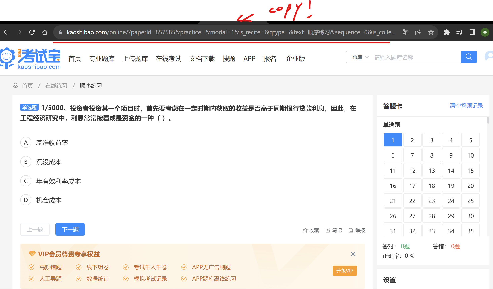
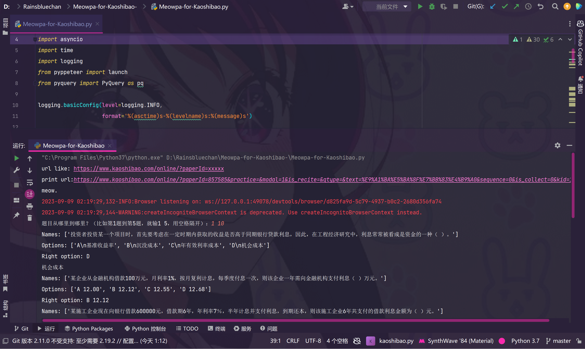

## Meowpa-for-Kaoshibao(.python)

### How to use?

#### find a ~

#### copy the url

#### before run

make sure the version of python is 3.7 or up(but i think 3.7 is the best)

and use the below at the folder

`pip install -r requirements.txt`

#### run

